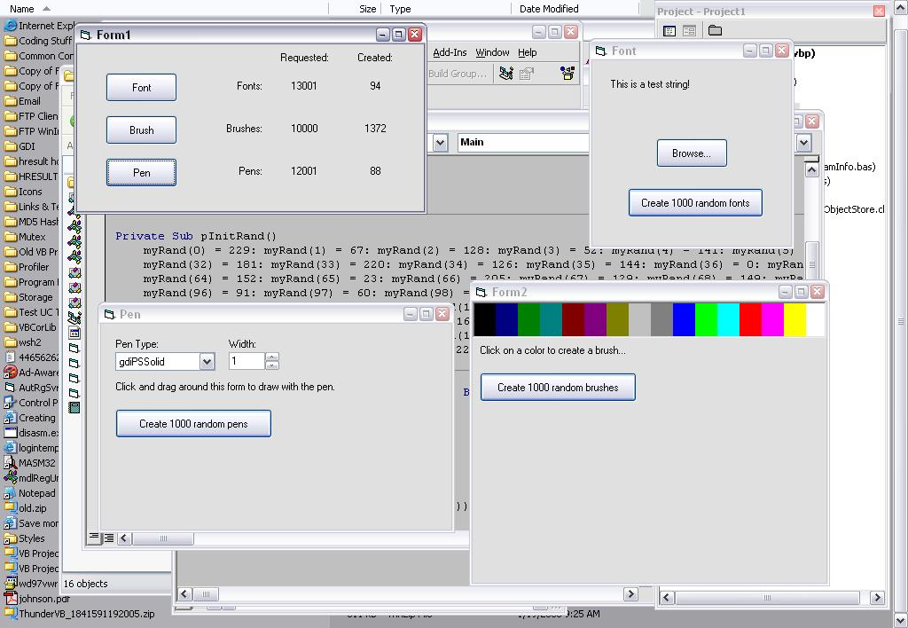



## GDI Management \(Updated 1/19/05\)

### Description

That horrible bug found by Lavolpe scared me into spending half the night going over this code with a fine-tooth comb. Minor optimizations and major commenting added. Anyone who downloaded the code before this update will probably want to scrap the old version and grab this one. Also check out the new screenshot. If that's not stress testing, I don't know what is!

Inspired by Lavolpe's "GDI Font Management" submission, this code is a drop-in replacement for common gdi api calls. The benefits of using this code as opposed to the api calls directly are two-fold:

1. Identical fonts, brushes and pens are shared between all procedures who request them. A reference count is kept, and the objects are deleted when no longer in use.

2. Debugging is simple, simply change a few compiler constants and you will receive a debug message if any font, brush, pen, DC, or bitmap handles are leaked.

This code is very fast, because it hashes the gdi objects and uses a linked list to store the necessary information. Actually it's a bit more complicated than that because the nodes in the list must be looked up by the gdi object when creating an object and by the handle when destroying it. So two linked lists are kept, but only one set of nodes. One is used to lookup by the gdi object and the other by handle.
 
### More Info
 

             |
---                |---
**Submitted On**   |2005-01-19 13:30:44
**By**             |[selftaught](https://github.com/Planet-Source-Code/PSCIndex/blob/master/ByAuthor/selftaught.md)
**Level**          |Intermediate
**User Rating**    |5.0 (35 globes from 7 users)
**Compatibility**  |VB 6\.0
**Category**       |[Graphics](https://github.com/Planet-Source-Code/PSCIndex/blob/master/ByCategory/graphics__1-46.md)
**World**          |[Visual Basic](https://github.com/Planet-Source-Code/PSCIndex/blob/master/ByWorld/visual-basic.md)
**Archive File**   |[GDI\_Manage1841861192005\.zip](https://github.com/Planet-Source-Code/selftaught-gdi-management-updated-1-19-05__1-58353/archive/master.zip)

